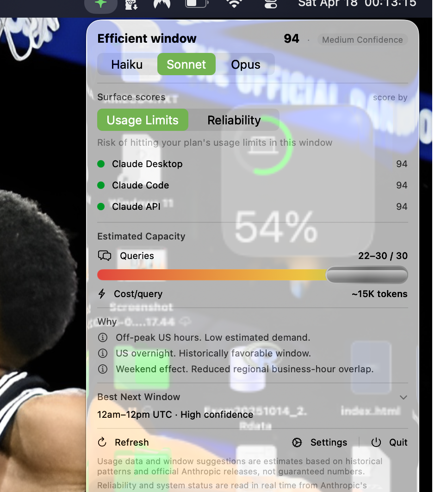

# Claude Window

**Stop guessing. Know when Claude is worth using.**

Claude Window lives in your menu bar and gives you a real-time signal: is this a good moment to send that heavy prompt, or should you wait?

**[⬇ Download for macOS →](https://github.com/renatomoscati-creator/claude-window/releases/latest)** · MIT License · No login required · No data sent



---

## What you get

- **Menu-bar icon** — green/yellow/orange/red at a glance
- **Score 0–100** with a plain-English "why"
- **Per-surface scores** for Claude.ai, Claude Code, and API — each has its own load profile
- **Estimated queries left** in your current 5-hour window, scaled to your plan + model
- **12-hour forecast** so you can schedule intensive work into optimal windows
- **"Best Next Window"** suggestion when the current hour isn't favorable
- **Local API** at `127.0.0.1:58742` — `/score`, `/capacity`, `/recommendation` for scripting

## Install (30 seconds)

1. [Download the latest release](https://github.com/renatomoscati-creator/claude-window/releases/latest)
2. Move `ClaudeWindow.app` to `/Applications`
3. Right-click → Open (first launch only, to bypass Gatekeeper on unsigned builds)

The app appears as a colored icon in your menu bar. Click it to open the dropdown.

> Signed & notarized DMG coming soon — will remove the right-click step.

## Privacy & transparency

- **No login required** — no Claude account, no Anthropic account
- **No access to your prompts or conversations**
- **Nothing leaves your machine** — the only outbound call is to Anthropic's public status page
- **Estimates are heuristic** — based on timing patterns and documented plan limits, not real-time data from Anthropic
- **Fully open source** — read every line at [ClaudeWindow/](ClaudeWindow/)
- MIT licensed

## Who it's for

Claude Pro and Max users who do deep work — long coding sessions, research, writing — and want to route that work into windows where Claude is least likely to be rate-limited or degraded. Especially useful if you use Claude Code, run multi-step agents, or frequently hit the 5-hour rolling limit.

## Screenshots

| Dropdown | Forecast |
|----------|----------|
|  |  |

## Accuracy caveat

Numbers are heuristic — calibrated from publicly documented plan limits and community-reported behavior, not a live feed from Anthropic:

- **Plan token budgets** — derived from documented message-count limits × a ~2,000 tokens/query average
- **Workload multipliers** — Claude Code runs longer tool-calling sessions, API is self-paced; these are estimates
- **Max-plan weekly Opus caps** — not yet modeled; the app uses the 5-hour rolling window as the single budget

If you have real usage data and want to tighten the numbers, a PR or issue is welcome.

## Build from source

<details>
<summary>Build instructions</summary>

```bash
git clone https://github.com/renatomoscati-creator/claude-window.git
cd claude-window
xcodebuild -project ClaudeWindow.xcodeproj -scheme ClaudeWindow -configuration Release build
open ~/Library/Developer/Xcode/DerivedData/ClaudeWindow-*/Build/Products/Release/ClaudeWindow.app
```

Requirements: macOS 13 (Ventura)+, Xcode 15+, Swift 5.9+

</details>

## Contributing

Tests live in `ClaudeWindowTests/`. Run with:

```bash
xcodebuild test -project ClaudeWindow.xcodeproj -scheme ClaudeWindow -destination 'platform=macOS'
```

Open an issue before starting a non-trivial change.

## License

[MIT](LICENSE) © 2026 Renato Moscati · [@renatomoscati-creator](https://github.com/renatomoscati-creator)
